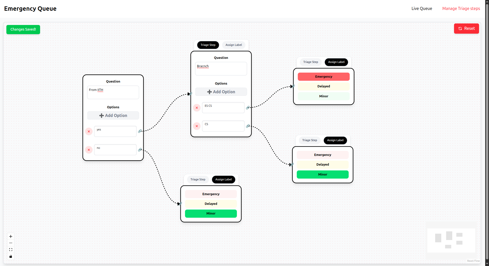
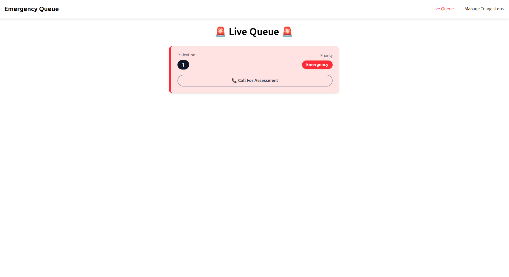
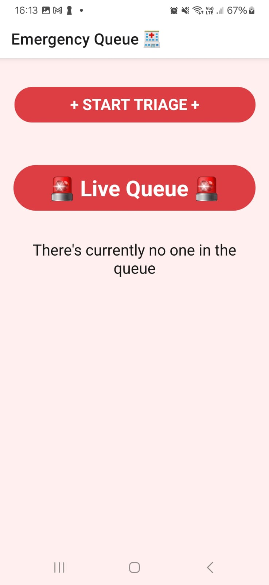
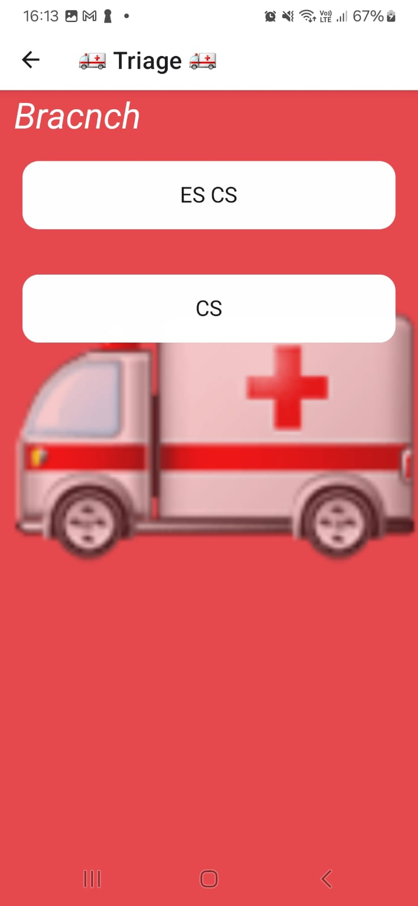
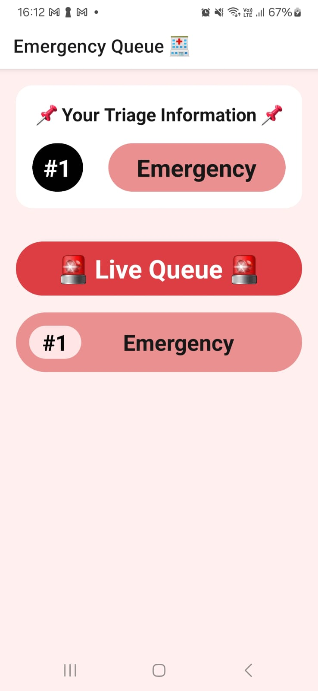
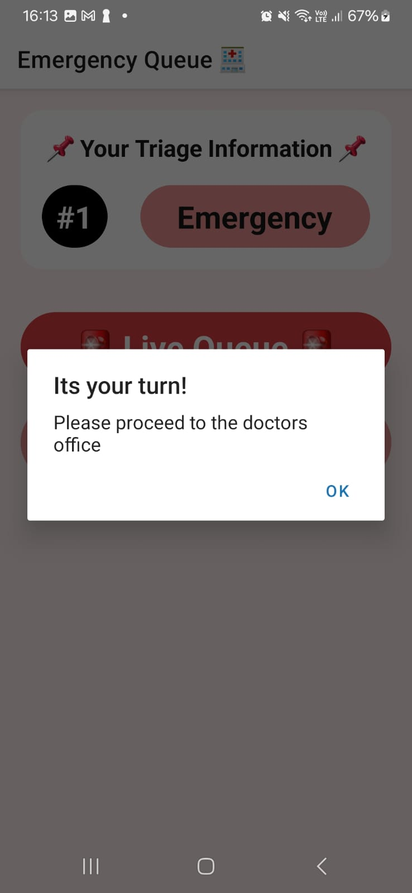

# 🚨 Emergency Queue System

A real-time **Emergency Queue System** designed to streamline emergency services across hospitals and related sectors. Built with:

- 🧠 **Backend**: Golang + MongoDB + Docker
- 💻 **Frontend**: React + TypeScript + PusherJS
- 📱 **Mobile App**: Expo + React Native

This system allows emergency requests to be queued, tracked, and managed efficiently across multiple platforms in real-time.

---

## 📸 Screenshots

### 🌐 Web Interface

**Dashboard**



**Queue Monitoring**



---

### 📱 Mobile App (Expo)

#### 🧭 Flow:
**Home Screen ➡️ Queue List ➡️ Request Status ➡️ Join Queue**

<p align="center">
  <br/>
  ⬇️
  <br/>
  ⬇️
  <br/>
  ⬇️
  
</p>

---

## ⚙️ Features

- Real-time **queue updates** using **PusherJS**
- **Mobile-first** queue registration for patients
- **Admin dashboard** to monitor & manage the queue
- **Scalable backend** with MongoDB and Docker
- Potential to extend to **graphs/networks of services**
- Participants can **join, leave, and track** the queue

---

## 🚀 Getting Started

### 📦 Start the Backend

```bash
cd server
make start
````

> 🐳 This runs the backend using Docker and sets up MongoDB.

---

### 🌐 Start the Web App

```bash
cd web
yarn dev
```

---

### 📱 Start the Mobile App (Expo)

```bash
cd mobile
yarn android
```

> 📱 Connect a USB device or use the **Expo Go App** to preview on your phone.

---

## 🧠 Tech Stack

| Layer    | Tech                    |
| -------- | ----------------------- |
| Backend  | Go, MongoDB, Docker     |
| Realtime | PusherJS                |
| Frontend | React, TypeScript, Vite |
| Mobile   | React Native, Expo      |
| Database | MongoDB (Dockerized)    |

---

## 🌱 Future Scope

* ⛑️ Integrate with hospital management systems
* 📍 Add geolocation for nearest queue detection
* 📊 Analytics dashboard for request trends
* 🤝 Graph-based extension for interlinked services (e.g. ambulance, fire, police)

---

## 🧪 Local Dev Tips

* Ensure Docker is running.
* MongoDB is configured to run inside Docker.
* Mobile app requires Android Studio or a real device.
* Use `.env` files in each directory (`server`, `web`, `mobile`) to customize URLs or keys.

---

## 🤝 Contributing

Feel free to fork and raise a PR. Whether it's fixing a bug, improving UI, or scaling architecture — **every contribution counts**.

---
